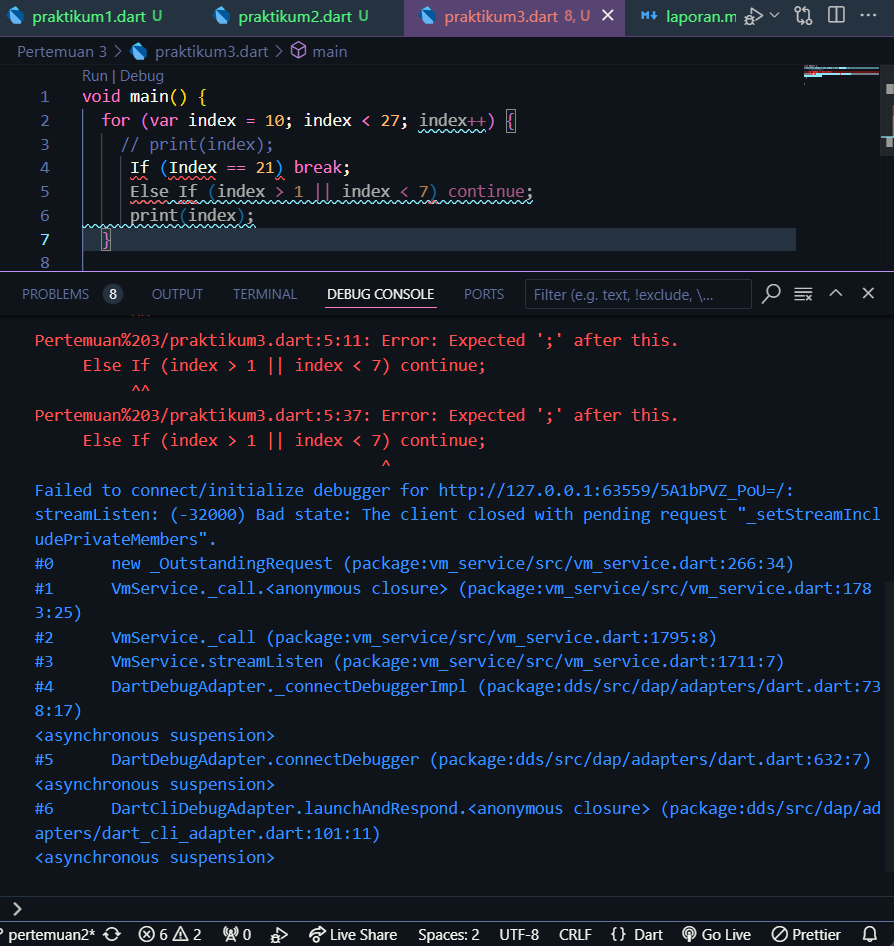

## Nama : Afrizal Dwi Septian
## Kelas : TI-3A
## Absen : 01

# Praktikum 1 : Menerapkan Control Flows ("if/else")

## Langkah 1

Ketik atau salin kode program berikut ke dalam fungsi main()

String test = "test2";
if (test == "test1") {
print("Test1");
} else If (test == "test2") {
print("Test2");
} Else {
print("Something else");
}

if (test == "test2") print("Test2 again");

## Langkah 2

Silakan coba eksekusi (Run) kode pada langkah 1 tersebut. Apa yang terjadi? Jelaskan!

Dilihat dari gambar diatas dapat terlihat terjadi error karena salah dalam penulisan if/else

pembenaran kode

## Langkah 3

Tambahkan kode program berikut, lalu coba eksekusi (Run) kode Anda.

Terjadi eror seperti gambar diatas, hal tersebut karena variabel String tidak bisa di assign sebagai boolean. dan kode diatas tidak bisa di run bersamaan dengan kode pada langkah 1 karena memiliki nama variabel yang sama. jika ingin dilakukan run secara bersamaan harus mengganti nama variabel pada langkah 2

pembenaran kode

# Praktikum 2 Menerapkan Perulangan "while" dan "do-while"

## Langkah 1

Ketik atau salin kode program berikut ke dalam fungsi main().

## Langkah 2

Silakan coba eksekusi (Run) kode pada langkah 1 tersebut. Apa yang terjadi? Jelaskan! Lalu perbaiki jika terjadi error.

Terjadi error sepeti gambar diatas, hal tersebut terjadi karena variabel conter belum di deklarasi

Perbaikan kode

setelah diperbaiki hasil run akan menampilkan perulangan angka dari 1 hingga 32

## Langkah 3

Tambahkan kode program berikut, lalu coba eksekusi (Run) kode Anda.

Apa yang terjadi ? Jika terjadi error, silakan perbaiki namun tetap menggunakan do-while.
dikarenakan pada langkah senelumnya sudah mendeklarasikan counter sehingga tidak . pada langkah ini akan menampilkan perulangan hingga 76

# Praktikum 3 Menerapkan Perulangan "for" dan "break-continue"

## Langkah 1

Ketik atau salin kode program berikut ke dalam fungsi main().

## Langkah 2

Silakan coba eksekusi (Run) kode pada langkah 1 tersebut. Apa yang terjadi? Jelaskan! Lalu perbaiki jika terjadi error.

terjadi error seperti gambar diatas, hal tersebut terjadi karena variabel index belum dideklarasikan. dan juga akan terjadi infinity karena tidak ada increment pada variabel index.
Pembenaran kode

## Langkah 3

Tambahkan kode program berikut di dalam for-loop, lalu coba eksekusi (Run) kode Anda.

Apa yang terjadi ? Jika terjadi error, silakan perbaiki namun tetap menggunakan for dan break-continue.

terjadi banyak error seperti gambar diatas

pembenaran kode

# Tugas Praktikum

Buatlah sebuah program yang dapat menampilkan bilangan prima dari angka 0 sampai 201 menggunakan Dart. Ketika bilangan prima ditemukan, maka tampilkan nama lengkap dan NIM Anda.

Hasil

