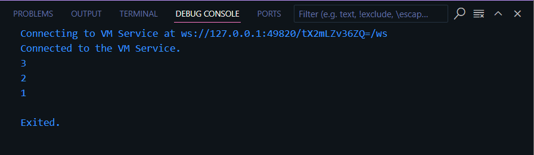
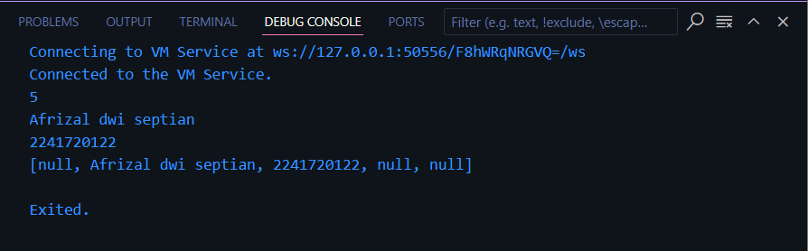
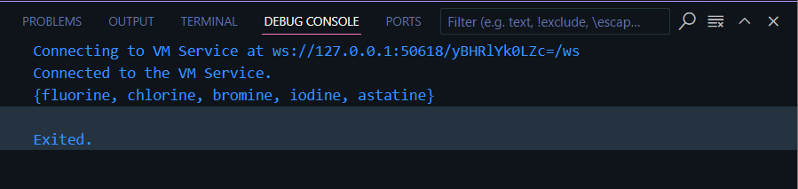
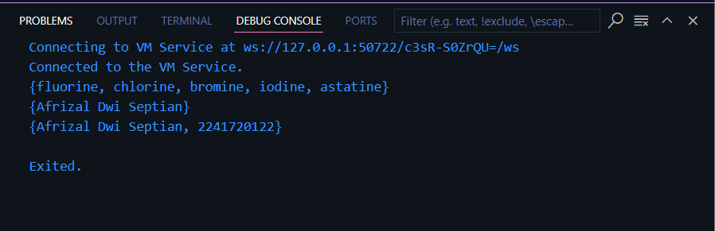
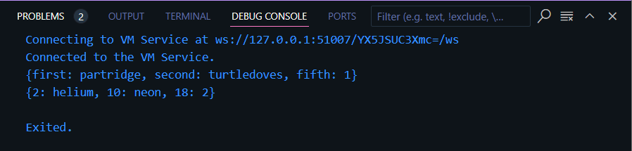
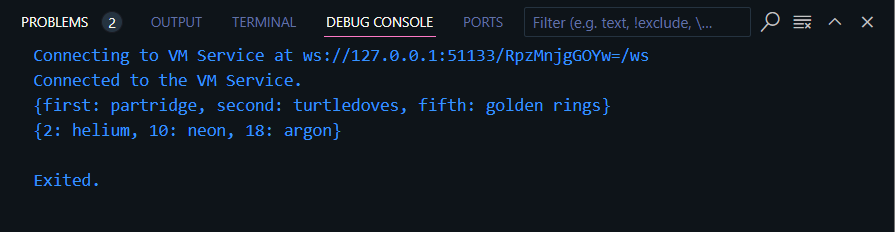
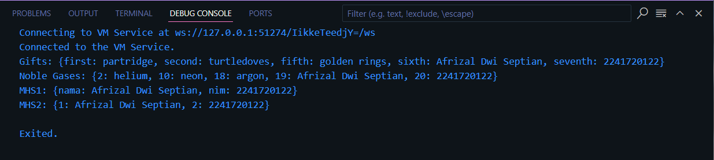
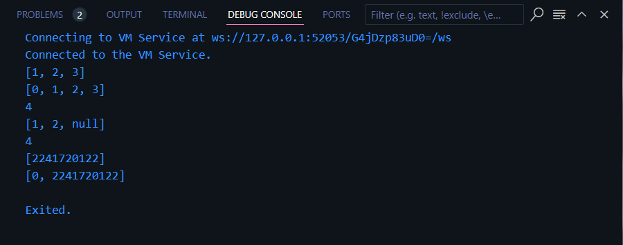
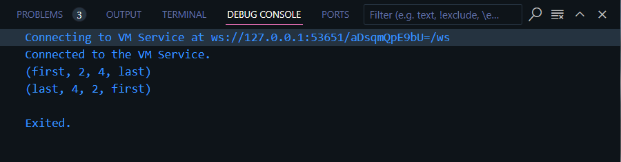
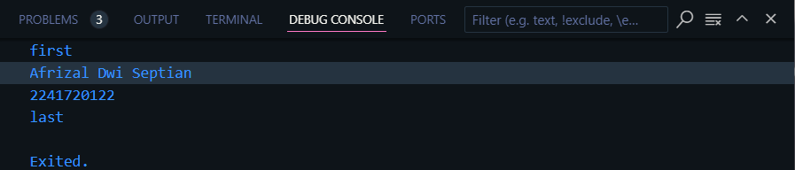

# Nama   : Afrizal Dwi Septian
# Kelas  : TI-3A
# Absen  : 01

# Praktikum 1 : Eksperimen Tipe Data List
## Langkah 1 
Ketik atau salin kode program berikut ke dalam void main().

``` dart
var list = [1, 2, 3];
assert(list.length == 3);
assert(list[1] == 2);
print(list.length);
print(list[1]);

list[1] = 1;
assert(list[1] == 1);
print(list[1]);
```

## Langkah 2
Silakan coba eksekusi (Run) kode pada langkah 1 tersebut. Apa yang terjadi? Jelaskan!



Jawab: Hasil output dari kode tersebut adalah seperti gambar di atas. ketika kode tersebut di run akan membuat sebuah list yaitu [1, 2, 3]. setelah tersebut ada proses assert atau pemeriksaan yaitu pemeriksaan apakah panjang list adalah 3 dan apakah list ke 1 adalah 2. setetlah itu akan mencetak panjang list, list  ke 1. dan untuk kode dibawahnya juga melakukan hal yang sama.

## Langkah 3
Ubah kode pada langkah 1 menjadi variabel final yang mempunyai index = 5 dengan default value = null. Isilah nama dan NIM Anda pada elemen index ke-1 dan ke-2. Lalu print dan capture hasilnya.

Apa yang terjadi ? Jika terjadi error, silakan perbaiki.

Jawab: Jika langsung dilakukan dengan kode awal akan terjadi beberapa eror yang pertama list tidak bisa diinisialisasi null, pemeriksaan pada assertion indeks juga akan salah dikarenakan berbeda dengan yang ada di dalam indeks masing masing list. sehingga perlu adanya perbaikan seperti dibawah.

``` dart
List<String?> list = [null, null, null, null, null];
assert(list.length == 5);
list[1] = 'Afrizal dwi septian';
assert(list[1] == "Afrizal dwi septian");
print(list.length);

print(list[1]);

list[2] = '2241720122';
assert(list[2] == "2241720122");
print(list[2]);
print(list);
```
dari kode diatas akan menghasilkan output seperti dibawah



# Praktikum 2 : Eksperimen Tipe Data Set
Selesaikan langkah-langkah praktikum berikut ini menggunakan VS Code atau Code Editor favorit Anda.

## Langkah 1
Ketik atau salin kode program berikut ke dalam fungsi main().
``` dart
var halogens = {'fluorine', 'chlorine', 'bromine', 'iodine', 'astatine'};
print(halogens);
```

## Langkah 2
Silakan coba eksekusi (Run) kode pada langkah 1 tersebut. Apa yang terjadi? Jelaskan! Lalu perbaiki jika terjadi error.



Jawab: Tidak terjadi eror, output dari kode tersebut seperti gambar diatas yaitu akan mencetak semua isis dari variabel halogens

## Langkah 3
Tambahkan kode program berikut, lalu coba eksekusi (Run) kode Anda.
``` dart
var names1 = <String>{};
Set<String> names2 = {}; // This works, too.
var names3 = {}; // Creates a map, not a set.

print(names1);
print(names2);
print(names3);
```

Apa yang terjadi ? Jika terjadi error, silakan perbaiki namun tetap menggunakan ketiga variabel tersebut. Tambahkan elemen nama dan NIM Anda pada kedua variabel Set tersebut dengan dua fungsi berbeda yaitu .add() dan .addAll(). Untuk variabel Map dihapus, nanti kita coba di praktikum selanjutnya.

Jawab: Tidak terjadi eror akan tetapi print tidak berisi apapun atau kosongan, berikut perbaikan kode dan outputnya.
``` dart
var halogens = {'fluorine', 'chlorine', 'bromine', 'iodine', 'astatine'};
print(halogens);

var names1 = <String>{};
Set<String> names2 = {}; 

names1.add('Afrizal Dwi Septian');

names2.addAll(['Afrizal Dwi Septian', '2241720122']);

print(names1);
print(names2);

```
Output



# Praktikum 3 : Eksperimen Tipe Data Maps
Selesaikan langkah-langkah praktikum berikut ini menggunakan VS Code atau Code Editor favorit Anda.

## Langkah 1
Ketik atau salin kode program berikut ke dalam fungsi main().
``` dart
var gifts = {
  // Key:    Value
  'first': 'partridge',
  'second': 'turtledoves',
  'fifth': 1
};

var nobleGases = {
  2: 'helium',
  10: 'neon',
  18: 2,
};

print(gifts);
print(nobleGases);

```

## Langkah 2
Silakan coba eksekusi (Run) kode pada langkah 1 tersebut. Apa yang terjadi? Jelaskan! Lalu perbaiki jika terjadi error.

Jawab: Tidak terjadi eror dan output akan mencetak seperti gambar diatas. karena Dart mendukung penggunaan tipe data campuran dalam sebuah Map. Pada deklarasi gifts, Map didefinisikan dengan kunci (Key) berupa String dan nilai (Value) yang bisa berupa String atau int. Misalnya, kunci 'first' memiliki nilai 'partridge' yang bertipe String, sementara kunci 'fifth' memiliki nilai 1 yang bertipe int.

## Langkah 3
Tambahkan kode program berikut, lalu coba eksekusi (Run) kode Anda.

``` dart
var mhs1 = Map<String, String>();
gifts['first'] = 'partridge';
gifts['second'] = 'turtledoves';
gifts['fifth'] = 'golden rings';

var mhs2 = Map<int, String>();
nobleGases[2] = 'helium';
nobleGases[10] = 'neon';
nobleGases[18] = 'argon';

```
Apa yang terjadi ? Jika terjadi error, silakan perbaiki.
``` dart
var gifts = {
    // Key:    Value
    'first': 'partridge',
    'second': 'turtledoves',
    'fifth': 1
  };

  var nobleGases = {
    2: 'helium',
    10: 'neon',
    18: 2,
  };

  print(gifts);
  print(nobleGases);

  var mhs1 = Map<String, String>();
  gifts['first'] = 'partridge';
  gifts['second'] = 'turtledoves';
  gifts['fifth'] = 'golden rings';

  var mhs2 = Map<int, String>();
  nobleGases[2] = 'helium';
  nobleGases[10] = 'neon';
  nobleGases[18] = 'argon';
  
```
Jawab: Tidak terjadi apapun, karna variabel mhs 1 dan 2 tidak digunakan sama sekali. akan tetapi jika kode tersebut di tempatkan sebelum print akan mengganti beberapa nilai/value seperti pada gifts key fiftth valuenya akan terganti menjadi 'golden ring' dan pada nobleGases 18 akan terganti dengan argon seperti pada gambar dibawah.





Tambahkan elemen nama dan NIM Anda pada tiap variabel di atas (gifts, nobleGases, mhs1, dan mhs2). Dokumentasikan hasilnya dan buat laporannya!
``` dart
  var gifts = <String, String>{
      // Key:    Value
    'first': 'partridge',
    'second': 'turtledoves',
    'fifth': 'golden rings'
  };

  var nobleGases = <int, String>{
    2: 'helium',
    10: 'neon',
    18: 'argon'
  };

  gifts['sixth'] = 'Afrizal Dwi Septian';
  gifts['seventh'] = '2241720122';

  nobleGases[19] = 'Afrizal Dwi Septian';
  nobleGases[20] = '2241720122';

  var mhs1 = <String, String>{};
  mhs1['nama'] = 'Afrizal Dwi Septian';
  mhs1['nim'] = '2241720122';

  var mhs2 = <int, String>{};
  mhs2[1] = 'Afrizal Dwi Septian';
  mhs2[2] = '2241720122';

  // Cetak hasil
  print('Gifts: $gifts');
  print('Noble Gases: $nobleGases');
  print('MHS1: $mhs1');
  print('MHS2: $mhs2');
  
```
Output 



# Praktikum 4 : Eksperimen Tipe Data List: Spread dan Control-flow Operators
Selesaikan langkah-langkah praktikum berikut ini menggunakan VS Code atau Code Editor favorit Anda.

## Langkah 1
Ketik atau salin kode program berikut ke dalam fungsi main().
``` dart
    var list = [1, 2, 3];
    var list2 = [0, ...list];
    print(list1);
    print(list2);
    print(list2.length);
```

## Langkah 2
Silakan coba eksekusi (Run) kode pada langkah 1 tersebut. Apa yang terjadi? Jelaskan! Lalu perbaiki jika terjadi error.

Jawab: akan terjadi error karen avariabel list1 tidak ada atau tidak dideklarasi.perbaikan kode adalah dengan mengganti print(list1) menjadi print(list)

## Langkah 3
Tambahkan kode program berikut, lalu coba eksekusi (Run) kode Anda.
``` dart
    list1 = [1, 2, null];
    print(list1);
    var list3 = [0, ...?list1];
    print(list3.length);
```
Apa yang terjadi ? Jika terjadi error, silakan perbaiki.

Jawab: Terjadi eror berikut karena varibael list1 belum dideklarasi perbaikannya
``` dart
    var list = [1, 2, 3];
    var list2 = [0, ...list];
    print(list);
    print(list2);
    print(list2.length);

    var list1 = [1, 2, null];
    print(list1);
    var list3 = [0, ...?list1];
    print(list3.length);
```

Tambahkan variabel list berisi NIM Anda menggunakan Spread Operators. Dokumentasikan hasilnya dan buat laporannya!
``` dart
    var list = [1, 2, 3];
    var list2 = [0, ...list];
    print(list);
    print(list2);
    print(list2.length);

    var list1 = [1, 2, null];
    print(list1);
    var list3 = [0, ...?list1];
    print(list3.length);

    var listNim = ['2241720122'];
    print(listNim);
    var list4 = [0, ...?listNim];
    print(list4);
```
Output


## Langkah 4
Tambahkan kode program berikut, lalu coba eksekusi (Run) kode Anda.
``` dart
    var nav = ['Home', 'Furniture', 'Plants', if (promoActive) 'Outlet'];
    print(nav);
```
Apa yang terjadi ? Jika terjadi error, silakan perbaiki. Tunjukkan hasilnya jika variabel promoActive ketika true dan false.

Jawab: terjadi eror karena variabel promoActive tidak dideklarasikan berikut perbaikan.
``` dart
    bool promoActive = true;
    var nav = ['Home', 'Furniture', 'Plants', if (promoActive) 'Outlet'];
    print(nav);
```
jika promoActive = true Outlet akan tercetak dan jika false tidak.

## Langkah 5
Tambahkan kode program berikut, lalu coba eksekusi (Run) kode Anda.
``` dart
    var nav2 = ['Home', 'Furniture', 'Plants', if (login case 'Manager') 'Inventory'];
    print(nav2);
```
Apa yang terjadi ? Jika terjadi error, silakan perbaiki. Tunjukkan hasilnya jika variabel login mempunyai kondisi lain.

Jawab: terjadi eror karena variabel login tidak di deskrpsikan dan penggunakan case tidak valid dengan if. perbaikan kode
``` dart
    var login = 'Manager'; 
    var nav2 = ['Home', 'Furniture', 'Plants', if (login == 'Manager') 'Inventory'];
    print(nav2); 
```
jika var login Manager maka akan mencetak inventory jika selain itu Inventori tidak tercetak hanya home,furniture,plants


## Langkah 6
Tambahkan kode program berikut, lalu coba eksekusi (Run) kode Anda.
``` dart
    var listOfInts = [1, 2, 3];
    var listOfStrings = ['#0', for (var i in listOfInts) '#$i'];
    assert(listOfStrings[1] == '#1');
    print(listOfStrings);
```
Apa yang terjadi ? Jika terjadi error, silakan perbaiki. Jelaskan manfaat Collection For dan dokumentasikan hasilnya. 

Jawab: akan menghasilkan output [#0, #1, #2, #3] Output ini menunjukkan isi dari listOfStrings, yang terdiri dari elemen pertama '#0' diikuti oleh elemen-elemen yang dihasilkan dari listOfInts dalam format string. Elemen-elemen tersebut adalah '#1', '#2', dan '#3', yang dihasilkan menggunakan Collection For. Collection For dalam Dart memberikan manfaat berupa keringkasan dan efisiensi dengan memungkinkan pembuatan koleksi baru dari data yang ada dalam satu baris kode. Hal ini mengurangi jumlah kode yang diperlukan dan meningkatkan keterbacaan, karena proses iterasi dan penambahan elemen dapat dilakukan secara langsung. 

# Praktikum 5: Eksperimen Tipe Data Records
Selesaikan langkah-langkah praktikum berikut ini menggunakan VS Code atau Code Editor favorit Anda.

## Langkah 1
Ketik atau salin kode program berikut ke dalam fungsi main().
``` dart
    var record = ('first', a: 2, b: true, 'last');
    print(record)
```

## Langkah 2
Silakan coba eksekusi (Run) kode pada langkah 1 tersebut. Apa yang terjadi? Jelaskan! Lalu perbaiki jika terjadi error.

Jawab: terjadi eror karenna setelah print tidak terdapat ";", untuk perbaikannya hanya perlu menambahakan ";" outputnya yaitu mencetak dari variabel record akan tetapi yang bertipe Strring terlebih dahulu

## Langkah 3
Tambahkan kode program berikut di luar scope void main(), lalu coba eksekusi (Run) kode Anda.
``` dart
    (int, int) tukar((int, int) record) {
        var (a, b) = record;
        return (b, a);
    }
```
Apa yang terjadi ? Jika terjadi error, silakan perbaiki. Gunakan fungsi tukar() di dalam main() sehingga tampak jelas proses pertukaran value field di dalam Records.

Jawab : error karena jenis variabel tidak sesuai dan jumlahnya berbeda. berikut perbaikannya.
``` dart
    (String, int, int, String) tukar((String, int, int, String) record) {
        var (a, b, c, d) = record;
        return (d, c, b, a);
    }

    void main() {
        var record = ('first', 2, 4, 'last');
        print(record);
        print(tukar(record));
    }
```
output



## Langkah 4
Tambahkan kode program berikut di dalam scope void main(), lalu coba eksekusi (Run) kode Anda.
``` dart
    // Record type annotation in a variable declaration:
    (String, int) mahasiswa;
    print(mahasiswa);
```
Apa yang terjadi ? Jika terjadi error, silakan perbaiki. Inisialisasi field nama dan NIM Anda pada variabel record mahasiswa di atas. Dokumentasikan hasilnya dan buat laporannya!

Jawab: Terjadi error karena variabel mahasiswa belum dideklarasi, perbaikan kode nya sebagai berikut
``` dart
   (String, int) mahasiswa = ('Afrizal Dwi Septian', 2241720122);
print(mahasiswa);
```

## Langkah 5
Tambahkan kode program berikut di dalam scope void main(), lalu coba eksekusi (Run) kode Anda.
``` dart
    var mahasiswa2 = ('first', a: 2, b: true, 'last');

    print(mahasiswa2.$1); // Prints 'first'
    print(mahasiswa2.a); // Prints 2
    print(mahasiswa2.b); // Prints true
    print(mahasiswa2.$2); // Prints 'last'
```
Apa yang terjadi ? Jika terjadi error, silakan perbaiki. Gantilah salah satu isi record dengan nama dan NIM Anda, lalu dokumentasikan hasilnya dan buat laporannya!

Jawab : tidak terjadi eror, berikut perbaikan kode dan output setelah penambahan nama dan nim
``` dart
    var mahasiswa2 = ('first', a:'Afrizal Dwi Septian', b:2241720122, 'last');

    print(mahasiswa2.$1); // Prints 'first'
    print(mahasiswa2.a); // Prints 2
    print(mahasiswa2.b); // Prints true
    print(mahasiswa2.$2); // Prints 'last'
```


#Tugas Praktikum
1. Silakan selesaikan Praktikum 1 sampai 5, lalu dokumentasikan berupa screenshot hasil pekerjaan Anda beserta penjelasannya!
Jawab: Sudah di masing masing praktikum diatas

2. Jelaskan yang dimaksud Functions dalam bahasa Dart!
Jawab: Functions dalam bahasa Dart adalah blok kode yang dapat dipanggil untuk menjalankan tugas tertentu. Functions dapat menerima input berupa parameter dan mengembalikan output. 

3. Jelaskan jenis-jenis parameter di Functions beserta contoh sintaksnya!
Jawab:Dalam Dart, terdapat beberapa jenis parameter yang dapat digunakan dalam fungsi diantaranya
    * Parameter Posisi: Parameter yang harus diisi berdasarkan urutan.
        ``` dart
            void greet(String name) {
                print('Hello, $name!');
            } 
        ```        
    * Parameter Default: Parameter yang memiliki nilai default jika tidak diisi.
        ``` dart
            void greet([String name = 'Guest']) {
                print('Hello, $name!');
            }
        ``` 
    * Parameter Nama: Parameter yang dapat dipanggil dengan nama, menggunakan tanda {}.
         ``` dart
             void greet({required String name}) {
                print('Hello, $name!');
             }
        ``` 
    * Parameter Posisi: Parameter yang harus diisi berdasarkan urutan.
         ``` dart
             void greet({required String name}) {
                print('Hello, $name!');
             }
        ``` 

4. Jelaskan maksud Functions sebagai first-class objects beserta contoh sintaknya!
Jawab: Dalam Dart, fungsi dianggap sebagai first-class objects, yang berarti fungsi dapat disimpan dalam variabel, diteruskan sebagai argumen ke fungsi lain, dan dikembalikan dari fungsi. Ini memungkinkan fungsi untuk diperlakukan seperti tipe data lainnya.
    ``` dart
        void greet() => print('Greetings!');

        void callFunction(Function func) {
        func();
        }

        void main() {
        var myFunc = greet;
        callFunction(myFunc);
        }
    ``` 

5. Apa itu Anonymous Functions? Jelaskan dan berikan contohnya!
Jawab:Anonymous Functions adalah fungsi yang tidak memiliki nama. Mereka sering digunakan untuk fungsi yang hanya perlu dijalankan sekali atau sebagai callback.
     ``` dart
         void main() {
            var fruits = ['apple', 'banana', 'cherry'];
            var lengths = fruits.map((fruit) => fruit.length);
            print(lengths.toList()); // Output: [5, 6, 6]
        }
    ``` 

6. Jelaskan perbedaan Lexical scope dan Lexical closures! Berikan contohnya!        
Jawab:      
     * Lexical Scope: Menunjukkan akses ke variabel berdasarkan lokasi di mana variabel tersebut didefinisikan.
        ``` dart
            void outerFunction() {
                var outerValue = 'Hello';
                void innerFunction() {
                    print(outerValue);
                }
                innerFunction();
            }

        ```        
    * Lexical Closures: Merujuk pada fungsi yang memiliki akses ke variabel di scope luar, meskipun fungsi tersebut dieksekusi di luar scope.
        ``` dart
             Function createMultiplier(int factor) {
                 return (int value) => value * factor;
             }

             void main() {
                var double = createMultiplier(2);
                print(double(5)); // Output: 10
             }
        ``` 

7. Jelaskan dengan contoh cara membuat return multiple value di Functions!      
Jawab: Di dalam Dart, dapat menggunakan Map untuk mengembalikan beberapa nilai dengan kunci tertentu.     
    ``` dart
    Map<String, dynamic> getUserInfo() {
        return {
            'name': 'Alice',
            'hobbies': Sleep,
        };
    }
    void main() {
        var userInfo = getUserInfo();
        print('Name: ${userInfo['name']}, Hobbies: ${userInfo['hobbies']}'); 
    }            
     ``` 
 Output: Name: Alice, Hobbies: sleep

8.Kumpulkan berupa link commit repo GitHub pada tautan yang telah disediakan di grup Telegram!
Jawab: Siap
