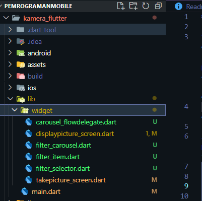

# **Tugas Praktikum**

1. Selesaikan Praktikum 1 dan 2, lalu dokumentasikan dan push ke repository Anda berupa screenshot setiap hasil pekerjaan beserta penjelasannya di file README.md! Jika terdapat error atau kode yang tidak dapat berjalan, 2.2.2. silakan Anda perbaiki sesuai tujuan aplikasi dibuat!
   **Jawab:** Laporan masing masing praktikum ada di masing masing folder

2. Gabungkan hasil praktikum 1 dengan hasil praktikum 2 sehingga setelah melakukan pengambilan foto, dapat dibuat filter carouselnya!

   **Jawab:**
   

   

   Hasil penggabungan ada di folder prakrikum kamera_flutter.

3. Jelaskan maksud void async pada praktikum 1?

   **Jawab:**

   Fungsi void async digunakan untuk mendeklarasikan fungsi asinkron, memungkinkan proses berjalan di latar belakang tanpa menghambat antarmuka pengguna (UI). Dalam praktikum 1, ini berguna untuk menjalankan tugas yang mungkin membutuhkan waktu, seperti mengambil gambar, tanpa mengganggu kelancaran UI. Misalnya, saat menggunakan ImagePicker untuk mengambil gambar, proses ini bisa memakan waktu, tetapi dengan async, aplikasi dapat tetap responsif karena tugas tersebut berlangsung secara paralel.

4. Jelaskan fungsi dari anotasi @immutable dan @override ?
   **Jawab:**

   **@immutable:** Anotasi ini menunjukkan bahwa sebuah kelas bersifat immutable atau tidak dapat diubah setelah dibuat. Dalam konteks widget, ini berarti semua variabel dalam kelas tersebut harus memiliki nilai final. Sebagai contoh, FilterSelector menggunakan anotasi ini untuk memastikan widget tidak dapat dimodifikasi setelah diinisialisasi.

   **@override:** Anotasi ini dipakai ketika suatu metode dalam subclass menggantikan metode yang ada di superclass. Anotasi ini memastikan bahwa metode yang didefinisikan memang ada di superclass, membantu mengurangi kesalahan jika nama metode di superclass mengalami perubahan.

5. Kumpulkan link commit repository GitHub Anda kepada dosen yang telah disepakati!
